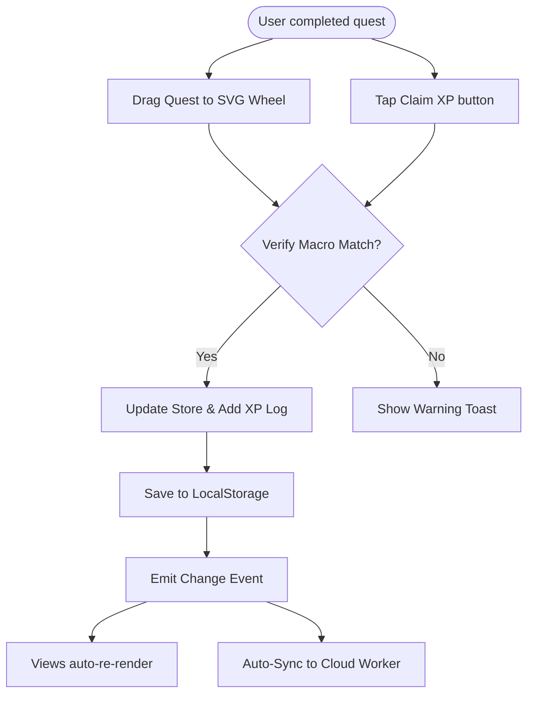

# LIFEMAXX — PWA DESIGN & ARCHITECTURE SPECIFICATION

Lifemaxx is a high-fidelity, gamified personal productivity RPG client-side Progressive Web Application (PWA). It translates real-world habits, projects, and fitness routines into standard RPG progression mechanics (Experience Points, Levels, Skill Trees, and Stat Spread charts), moderated by an uncompromising AI Game Master Coach.

---

## 1. TECHNICAL STACK & ARCHITECTURE

*   **Frontend**: Single Page Application (SPA) built with vanilla HTML5, CSS3, and modern ECMAScript (ES6). No client-side framework (React/Vue) is used, ensuring high performance, zero build dependencies, and instant loads.
*   **Routing**: Native hash-based client-side router (`js/main.js`). Listens to `hashchange` events and matches routes (`#dashboard`, `#quests`, `#stats`, `#me`, `#coach`, `#settings`) to render custom view controllers dynamically in a `<main id="main-content">` area.
*   **State Management (`js/store.js`)**: Real-time localized state machine acting as a single source of truth. Handles automatic saves to `localStorage` and triggers custom events (`S.emit('change')`) that views subscribe to for automatic re-renders.
*   **AI Integration (`js/ai-engine.js`)**: Direct interface with the Google Gemini API (defaulting to `gemini-1.5-flash` or newer models in AI Studio) for smart quest recommendations, performance critiques, and chat.
*   **Synchronization Engine (`worker.js` / Netlify worker)**: Environment-agnostic endpoint handling CORS and token verification for real-time backup, auto-sync, and multi-device data alignment.

---

## 2. THE SYSTEM BRANDING & VISUAL STYLE

Lifemaxx implements a sleek, high-contrast cyber-vaporwave visual language:

*   **Colors**:
    *   `Background`: Deep Dark Navy/Purple (`#0d0d1a`)
    *   `Primary Accent`: Bright Cyan (`#00e5ff`)
    *   `Secondary Accent`: Hot Pink/Magenta (`#ff2d78`)
    *   `Muted Text`: Slate Grey/Muted Purple (`#9090b0`)
*   **Typography**: Google Font **Space Grotesk** for all headings (capitalized, loud, high-impact) and clean sans-serif for reading body elements.
*   **CSS Backdrops (`css/main.css`)**:
    *   An ambient wireframe cyan grid overlay on the page body.
    *   A 3D perspective wireframe landscape floor rotating at the base of the interface.
    *   A glowing sliced retro synthwave sun background rendering with gradient masks and horizontal scanlines.
*   **Card Styling**: Flat, solid dark panels (`rgba(15,15,26,0.7)`) with a clean left border accent line in cyan or pink. No heavy glassmorphism to preserve readability.

---

## 3. CORE LOGICS & DATA FORMULAS (`js/formulas.js`)

### Level Progression & XP Formulas
The player has an overall level, and each Macro Skill / Micro Skill maintains its own level.
*   **XP to Level up**: The XP required to level up grows exponentially.
    $$\text{XP Required} = \lfloor 100 \times (1.5)^{\text{Level}} \rfloor$$
*   **Current XP into Level**: Calculates the remaining XP within the current level boundary.
*   **Format XP**: Helper function formatting numbers (e.g., `1,250` XP).

### Time Window Availability
Quests can be locked behind specific time windows (e.g. `06:00 - 09:00`). The utility function parses current client hours and compares against range boundaries to return `isLocked`.

### Win Streak Tracker
The Day Win Streak is computed dynamically:
1.  Iterates through all completed quests and XP action logs.
2.  Maps completion timestamps to calendar date strings.
3.  Evaluates consecutive date increments backwards from today/yesterday.
4.  Returns total streak. If the gap between the latest completed date and today is greater than 1 day, the streak is reset to 0.

---

## 4. LOCAL DATA STRUCTURES & SCHEMAS

### Macro Skill
```json
{
  "id": "body",
  "name": "Body",
  "currentLevel": 4,
  "currentXP": 450,
  "accentColor": "#ff2d78",
  "microSkills": [
    {
      "id": "cardio",
      "name": "Cardio Endurance",
      "currentLevel": 2,
      "currentXP": 150
    }
  ]
}
```

### Quest Instance
```json
{
  "id": "uuid-1234",
  "name": "Morning Cardio Interval Run",
  "description": "25 mins HIIT sprints on treadmill",
  "type": "habit", // "habit" (recurrent), "project" (one-time completion), "boss" (major boss fight)
  "status": "active", // "active", "completed", "missed", "deleted"
  "isNegativeOnMiss": true, // penalty if missed (deducts XP on expiry)
  "isNegativeOnComplete": false,
  "targetSkills": [
    { "macroSkillId": "body", "microSkillId": "cardio", "xpAmount": 80 }
  ],
  "scheduledDays": [1, 3, 5], // Monday, Wednesday, Friday
  "timeWindow": { "start": "06:00", "end": "09:00" },
  "streak": 0, // Current habit completion streak
  "createdAt": 1716301290382,
  "completedAt": null,
  "subTasks": [
    { "id": "st-1", "name": "Stretch and warmup", "isCompleted": false },
    { "id": "st-2", "name": "5x Sprints", "isCompleted": false }
  ],
  "timedResearch": {
    "enabled": false,
    "durationMinutes": 30,
    "timerStartedAt": null
  }
}
```

---

## 5. APP VIEWS & PAGES

### 5.1. Dashboard (`js/views/dashboard.js`)
*   **Operator Status Card**: Shows title (e.g. `VANGUARD II`), level, and next tier progression bar.
*   **Streak & Buff Banners**: Large glowing win streak number next to active status multipliers (e.g., buff multipliers).
*   **Macro-to-Micro Expander**: List of all Macro skills as horizontal pills. Tapping a pill shows its name and expands its list of micro-skills, rendering their respective levels and progress.
*   **Next Session**: atmospheric banner showcasing the immediate upcoming scheduled active project or habit.
*   **Active Objectives (Top 3)**: A prioritized list of active, unlockable quests.
*   **Upcoming Objectives**: Greyed-out locked quests with a lock icon.
*   **Skill Wheel Drop Zone**: A responsive SVG skill wheel. Users on desktop can complete quests by dragging a card and dropping it directly into the wheel slices to register the XP. On mobile, cards render a direct "✓ Claim XP" button.

### 5.2. Quest Log / Archive (`js/views/quest-log.js`)
*   **Quest Log tab**: Includes filter controls (All/Active/Completed/Missed/Deleted) and skill dropdowns. Enables expandable cards detailing descriptions, subtask lists with checkboxes, and timed-research timers.
*   **XP Timeline tab**: Scrollable timeline of every historic XP completion event with timestamps, reasons, and links to details.
*   **Stats & Trends tab**: Shows completion ratios, total quest completions by type, and weekly performance numbers.

### 5.3. Stats (`js/views/stats.js`)
*   **Attribute spread chart**: SVG polygon mapping Macro Skill ratios on 8 axis grids.
*   **Lifetime XP**: Total overall XP earned displayed in giant neon typography.
*   **XP Action Log**: Chronological audit trail of XP gains and level-ups.

### 5.4. Me / Profile (`js/views/me.js`)
*   **Operator Info**: Displays username, status badges (`PEAK`, `NEURAL MAPPED`), and weekly quotas tracking completed quests against a rolling 7-day target (default: 3 completions per skill area).

### 5.5. AI Coach Fletcher (`js/views/coach.js`)
An interactive Whiplash-style coach dialogue box:
*   **Open Chat**: Direct text interaction in character with Fletcher.
*   **Morning Brief**: Sends player profiles, energy level (High/Med/Low), and skill IDs to Gemini to dynamically output recommended daily quests formatted as JSON. The app parses the JSON and injects the quests directly into the active quests list.
*   **Performance Review**: Direct evaluation of completed and missed quests for the last 7 days. Fletcher reviews the list and returns a blunt critique with 3 actionable recommendations.

### 5.6. Settings (`js/views/settings.js`)
*   **Presets Management**: Templates for creating daily schedules.
*   **Gameplay toggles**: Options like "Drag to complete", "Delete after drag", and Gemini daily request limit bounds.
*   **Gemini API Key**: Secure endpoint linking the player's personal API key.
*   **Cloud Backup**: Pairing key syncing engine, import/export buttons.

---

## 6. SYSTEM FLOWS & EVENTS


